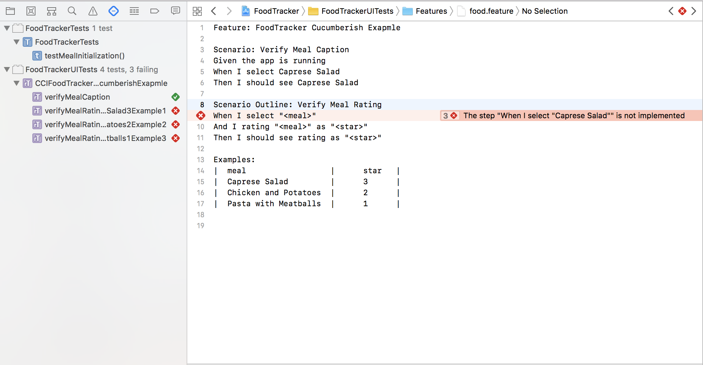

# xcuitest_cucumberish
> This Project is for XCUITest + Cucumberish Demo.

The FoodTracker App is based on following instruction:

iOS Developer Library: [Start Developing iOS Apps (Swift)](https://developer.apple.com/library/ios/referencelibrary/GettingStarted/DevelopiOSAppsSwift/)

FoodTracker App: [Mario's FoodTracker](https://github.com/Mokolea/FoodTracker)

## Cucumberish Installation:

Installation Guild: [Find Cucumberish Wiki Page](https://github.com/Ahmed-Ali/Cucumberish/wiki)

> Both of Cocoapods / Carthage frameworks for swift on this project

## Execution Test:

Execute by the command line:

```sh
xcodebuild test -workspace FoodTracker.xcworkspace -scheme FoodTracker -destination 'platform=iOS Simulator,name=iPhone 8 Plus,OS=11.3'
```

Or, you can execute it by XCode test navigator.


## Useful Sample:

- Support Scenario / Scenrio Outline
```
Scenario Outline: Verify Meal Rating
When I select "<meal>"
And I rating as <star>
Then I should see "<meal>" rating as <star>

Examples:
|  meal                  |      star   |
|  Caprese Salad         |      2      |
|  Chicken and Potatoes  |      5      |
|  Pasta with Meatballs  |      1      |
```

- Page Object Patterns
```
class MainPage: Page {
    private lazy var title = findElement(.navigationBar)["Your Meals"].firstMatch
    
    required init() {
        waitFor(element: title)
    }
    
    @discardableResult func doSomething(_ intputParameter: Object) -> MainPage{
    	// doSomehting

        return self
    }
}
```

- Show failure error on feature steps


## Documentation:
Blog: [XCUITest with Cucumberish](https://medium.com/@loverjersey/%E4%BD%BF%E7%94%A8-xcuitest-%E7%8E%A9-cucumber-xcuitest-with-cucumberish-a4770bec7f0c)


## Author

Jersey Su – [@jerseysu](https://twitter.com/jerseysu) 
